# Database schema

Reference for the CalSight Postgres schema as it exists in production (self-hosted on Proxmox LXC 100) as of 2026-04-28. This document is descriptive — it reflects what the DB actually contains, not what `backend/app/models.py` on `main` currently describes (the ORM lags the DB; see CLAUDE.md).

Run `python backend/scripts/probe_db.py` (when added) to regenerate the row-count summary.

## Entity relationship diagram

```mermaid
erDiagram
    counties ||--o{ crashes : "county_code"
    counties ||--o{ demographics : "county_code"
    counties ||--o{ data_quality_stats : "county_code (nullable)"
    counties ||--o{ unemployment_rates : "county_code"
    counties ||--o{ weather : "county_code"
    counties ||--o{ vehicle_registrations : "county_code"
    counties ||--o{ licensed_drivers : "county_code"
    counties ||--o{ road_miles : "county_code"
    counties ||--o{ hospitals : "county_code"
    counties ||--o{ school_locations : "county_code"
    counties ||--|| calenviroscreen : "county_code (unique)"
    counties ||--|| traffic_volumes : "county_code (unique)"
    counties ||--o{ speed_limits : "county_code"
    counties ||--o{ county_insights : "county_code"
    counties ||--o{ county_insight_details : "county_code"

    crashes ||..o{ crash_parties : "(collision_id, data_source)"
    crashes ||..o{ crash_victims : "(collision_id, data_source)"

    crashes ||..o{ mv_crashes_by_year : "derived"
    crashes ||..o{ mv_crashes_by_cause : "derived"
    crashes ||..o{ mv_crashes_by_hour : "derived"

    counties {
        smallint code PK
        varchar name
        varchar fips
        float latitude
        float longitude
        int population
        float land_area_sq_miles
        text geojson
    }
    crashes {
        bigint id PK
        bigint collision_id
        varchar data_source "switrs|ccrs"
        timestamp crash_datetime
        smallint county_code FK
        smallint crash_year "derived"
        smallint crash_hour "derived"
        varchar severity "derived: Fatal|Injury|Property Damage Only"
        varchar canonical_cause "derived: dui|speeding|lane_change|other"
        boolean is_alcohol_involved "CCRS only"
        boolean is_distraction_involved "CCRS only"
        varchar county_name "denormalized"
        smallint number_killed
        smallint number_injured
        float latitude
        float longitude
    }
    crash_parties {
        bigint id PK
        bigint party_id
        bigint collision_id "join with data_source"
        varchar data_source
        varchar party_type
        boolean at_fault
        smallint age
        varchar gender
        varchar sobriety
    }
    crash_victims {
        bigint id PK
        bigint victim_id
        bigint collision_id "join with data_source"
        varchar data_source
        smallint age
        varchar gender
        varchar injury_severity
        varchar person_type
    }
    mv_crashes_by_year {
        smallint county_code
        smallint crash_year
        varchar severity
        int crash_count
        int total_killed
        int total_injured
    }
    mv_crashes_by_cause {
        smallint county_code
        smallint crash_year
        varchar severity
        varchar canonical_cause
        int crash_count
        int total_killed
        int total_injured
    }
    mv_crashes_by_hour {
        smallint county_code
        smallint crash_year
        varchar severity
        varchar canonical_cause
        smallint crash_hour
        int crash_count
    }
    demographics {
        int id PK
        smallint county_code FK
        smallint year
        int population
        float median_age
        int median_income
        float pct_white
        float pct_black
        float pct_asian
        float pct_hispanic
        float poverty_rate
        float population_density
    }
    data_quality_stats {
        int id PK
        smallint county_code FK "nullable: NULL = statewide"
        smallint year "nullable: NULL = all-time"
        int total_crashes
        float coords_pct
        float alcohol_flag_pct
    }
```



## Row counts (2026-04-28)

| Table / View | Rows | Notes |
|---|---:|---|
| `crashes` | 11,129,647 | SWITRS 6.78M + CCRS 4.35M |
| `crash_parties` | 8,804,729 | CCRS only (party_id unique within `data_source`) |
| `crash_victims` | 5,297,539 | CCRS only |
| `weather` | 17,315 | NOAA, monthly per county |
| `unemployment_rates` | 14,558 | BLS, monthly per county |
| `school_locations` | 9,932 | CDE, K-12 public schools |
| `data_quality_stats` | 1,574 | See "scope" below |
| `demographics` | 1,012 | ACS, yearly per county; **36 fields** as of 2026-04-18 (added gender + economic + equity + niche fields — see field reference below) |
| `licensed_drivers` | 969 | DMV, yearly per county |
| `hospitals` | 560 | HCAI, includes trauma centers |
| `vehicle_registrations` | 464 | DMV, yearly per county (incl EV count) |
| `road_miles` | 355 | Caltrans, by county + functional class |
| `speed_limits` | 171 | Caltrans, segment summary by county+limit |
| `counties` | 58 | Lookup |
| `calenviroscreen` | 58 | Population-weighted county avg |
| `traffic_volumes` | 58 | Caltrans AADT, one row per county |
| `county_insights` | **0** | Empty until issue #68 generates rows |
| `county_insight_details` | **0** | Empty until issue #68 generates rows |
| `mv_crashes_by_year` | 4,405 | Populated. Years 2001–2026. |
| `mv_crashes_by_cause` | 19,724 | Populated. Includes `canonical_cause`. |
| `mv_crashes_by_hour` | 306,929 | Populated. **No killed/injured columns.** |
| `mv_crash_victims_by_demographics` | 26,360 | Populated 2026-04-18. JOINs `crash_victims` to `crashes` on `(collision_id, data_source)`. Aggregates by (county, year, severity, gender, age_bracket). Powers `/api/stats?group_by=gender|age_bracket`. **Counts victims, not crashes.** |

## Key constraints and gotchas

### `(collision_id, data_source)` is the real join key

`crashes`, `crash_parties`, and `crash_victims` all carry `collision_id` and `data_source`. Joining on `collision_id` alone yields **3,845,271** spurious matches — SWITRS and CCRS use overlapping numeric ID spaces. Always join on the pair:

```sql
-- WRONG
JOIN crash_parties p ON p.collision_id = c.collision_id

-- RIGHT
JOIN crash_parties p ON p.collision_id = c.collision_id
                     AND p.data_source = c.data_source
```

The unique constraint `uq_crashes_collision_source` enforces `(collision_id, data_source)` uniqueness on `crashes`. Note that `crash_parties.party_id` and `crash_victims.victim_id` similarly need `(_, data_source)` for uniqueness — there is no FK relationship between these tables and `crashes`, only the implied logical join.

### Severity has 3 values, not 4

`crashes.severity` actual distribution:

| Value | Count |
|---|---:|
| `Property Damage Only` | 6,705,497 |
| `Injury` | 4,341,304 |
| `Fatal` | 82,842 |
| `NULL` | 4 |

Branch #39's model docstring claims 4 values (`Severe Injury`/`Minor Injury` instead of `Injury`). That docstring is stale; issue #102 plans to align by deriving 4 buckets from `crash_victims.injury_severity` later.

### Canonical_cause has 4 values + NULL

| Value | Count |
|---|---:|
| `other` | 5,492,133 |
| `speeding` | 3,370,827 |
| `lane_change` | 1,043,473 |
| `dui` | 842,203 |
| `NULL` | 381,011 |

`NULL` indicates `primary_factor` was itself NULL. Issue #103 plans to expand the taxonomy.

### Alcohol/distraction flags are CCRS-only

| `data_source` | Total | `is_alcohol_involved` filled | `is_distraction_involved` filled |
|---|---:|---:|---:|
| `switrs` | 6,779,445 | 0 | 0 |
| `ccrs` | 4,350,202 | 4,350,202 (100%) | 4,350,202 (100%) |

Filtering by these flags implicitly limits results to 2016+ (CCRS coverage). Endpoints should not pretend otherwise.

### `data_quality_stats` granularity (NULL semantics)

`(county_code, year)` are both nullable; the NULL pattern encodes scope:

| `county_code` | `year` | Rows | Meaning |
|---|---|---:|---|
| not null | not null | 1,490 | County × year fill rates |
| not null | NULL | 58 | Per-county all-time |
| NULL | not null | 26 | Statewide per-year |
| NULL | NULL | 0 | Statewide all-time (not yet populated) |

API consumers should treat NULLs in returned rows as "this scope" markers, not missing data.

### Materialized view granularity

The 4 MVs are not interchangeable — pick the smallest one that supports your filters:

- **`mv_crashes_by_year`** (4.4K rows): no `canonical_cause` column. Use when no cause filter is in play.
- **`mv_crashes_by_cause`** (19.7K rows): adds `canonical_cause`. Use when filtering or grouping by cause.
- **`mv_crashes_by_hour`** (307K rows): adds `crash_hour` AND drops `total_killed`/`total_injured`. Only use for hour-grouped queries; can return counts only, not casualty totals.
- **`mv_crash_victims_by_demographics`** (26K rows): totally different dimensions — counts **victims**, not crashes, and breaks them down by `(county, year, severity, gender, age_bracket)`. Use for `?group_by=gender|age_bracket`. Source rows are `crash_victims` JOINed to `crashes` on `(collision_id, data_source)`; one fatal crash with 3 injured passengers contributes 3 to `victim_count`. Has no `canonical_cause` column, so the cause filter is rejected on these grouping paths.

### Extra bucket values introduced by the MVs

The view DDL uses `COALESCE(severity, 'Unknown')` and `COALESCE(canonical_cause, 'uncategorized')` so NULL keys don't collapse into a single bucket. As a result, output of `/api/stats?group_by=cause|severity` includes two values that are **not** in the base table:

- `canonical_cause = 'uncategorized'` — ~381K crashes (3.4%) where `crashes.canonical_cause` is NULL. Filter input still accepts only `dui|speeding|lane-change|other`; consumers get this value only in grouped output.
- `severity = 'Unknown'` — 4 crashes (negligible) where `crashes.severity` is NULL.

Ignore or hide both when presenting a fixed taxonomy; keep when plotting distributions so the total matches `COUNT(*)`.

Refresh is concurrent (each view has a UNIQUE index), wired into the ETL orchestrator (issue #101). Until #109 ships a freshness pill, consumers can't see how stale a view is.

### PostGIS is not installed

Spatial endpoints (`?bbox=...`) and any `ST_*` functions will fail. Issue #107 tracks the install. Map UIs render from county-level aggregates (`/api/stats?group_by=county`) until #107 lands.

## Demographics field reference (36 fields)

Per (county, year). Sourced from Census ACS 5-year (2010+) or ACS 1-year (2005-2009; smaller counties absent for those years).

| Group | Fields |
|---|---|
| **Identity** | `id`, `county_code`, `year` |
| **Basics** | `population`, `median_age`, `median_income`, `population_density`, `per_capita_income` (B19301) |
| **Race/Ethnicity** (B03002) | `pct_white`, `pct_black`, `pct_asian`, `pct_hispanic`, `pct_other_race` |
| **Age** (B01001) | `pct_under_18`, `pct_18_24`, `pct_25_44`, `pct_45_64`, `pct_65_plus` |
| **Sex** (B01001) | `pct_male`, `pct_female` |
| **Socioeconomic** | `poverty_rate` (B17001), `pct_bachelors_or_higher` + `pct_high_school_or_higher` (B15003 — null pre-2012) |
| **Housing/Transport** | `pct_no_vehicle` (B08201), `pct_owner_occupied_housing` (B25003), `pct_rent_burdened` (B25070; ≥30% of income in rent) |
| **Commute** (B08006) | `commute_drive_alone_pct`, `commute_carpool_pct`, `commute_transit_pct`, `commute_walk_pct`, `commute_bike_pct`, `commute_wfh_pct`, `mean_travel_time_to_work` (B08013 / commute_total) |
| **Equity / lifecycle** | `pct_foreign_born` (B05002), `pct_enrolled_in_school` (B14001), `pct_veteran` (B21001), `pct_with_disability` (B18101) |
| **Language** (B16001) | `pct_english_only`, `pct_spanish_speaking` |

**Coverage caveats** as of 2026-04-18 ETL:
- `per_capita_income`, `pct_male`, `pct_female`, `pct_foreign_born`, `pct_rent_burdened`, `pct_enrolled_in_school`, `pct_veteran`: **954/1012** (matches existing demographics gap — pre-2010 small counties not in ACS1)
- `mean_travel_time_to_work`: **912/1012** (B08013 absent in some early-year requests)
- `pct_with_disability`: **718/1012** (B18101 not consistently published before 2010)
